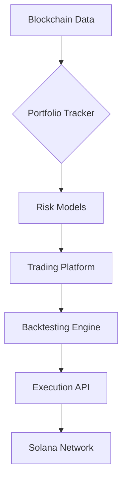

# Solana Trading Tools Suite

**Algorithmic Trading Infrastructure for Solana Cryptocurrencies**

---

## Overview

I work on a collection of projects that leverage the Solana blockchain for algorithmic trading and portfolio management. While I enjoy experimenting with various platforms, my primary focus is the **Solana Trading Bot**—a fully automated trading system designed for the Solana blockchain. This bot integrates data ingestion, strategy execution, risk management, and real-time monitoring in a modular, automated approach .

---

## Projects

### ⚡ Solana Trading Bot ([solana-bot](https://github.com/jadenfix/solanatools/tree/main/solana-bot))
*The main project and focus*

The **Solana Trading Bot** is built for the Solana blockchain and automates many aspects of trading, including:
- **Data Ingestion:** Combining historical and real-time market data.
- **Strategy Engine:** Supporting both backtesting and live execution (for example, using an RSI Momentum strategy).
- **Execution Engine:** Submitting orders with error handling and MEV protection via Jito.
- **Risk Management:** Managing exposure with stop-loss and take-profit triggers.
- **Wallet & Authentication:** Securely handling wallet keys and transaction signing.
- **Monitoring & Alerts:** Providing real-time performance metrics and automated alerts via Prometheus.

For more details on its architecture, project structure, and key features, please visit the [solana-bot directory](https://github.com/jadenfix/solanatools/tree/main/solana-bot).

---

### 🧪 Strategy Backtesting ([backteststrats.ipynb](https://github.com/jadenfix/solanatools/blob/main/backteststrats.ipynb))
*A framework for quantitative analysis of Solana alternative coins*

```python
# RSI-based trading strategy example
class MemeCoinStrategy(Strategy):
    def init(self):
        self.rsi = self.I(RSI, self.data.Close, 14)
        self.vol_ma = self.I(lambda v: v.rolling(24).mean(), self.data.Volume)
    
    def next(self):
        if self.rsi[-1] < 30 and self.data.Volume[-1] > 1.5 * self.vol_ma[-1]:
            self.buy()
        elif self.rsi[-1] > 70:
            self.sell()
```
Features:
	•	Uses historical OHLCV data from the Helius API
	•	Parameter optimization through grid search
	•	Models commission and slippage
	•	Provides performance metrics (e.g., Sharpe ratio, max drawdown)

Tech Stack: backtesting.py | pandas | numpy | websockets | solana-py

📊 Portfolio Tracker (solana_portfolio)

A multi-wallet asset monitoring tool with ML-driven insights

Project Structure:
```
├── api/               # FastAPI endpoints
├── config/            # Environment configurations
├── core/              # Business logic
├── data_access/       # Blockchain data connectors
├── data_processing/   # Data transformation pipelines
├── ml/                # Machine learning models
├── portfolio/         # Portfolio analysis engine
├── simulation/        # Trading scenario simulations
├── tests/             # Unit/integration tests
├── Dockerfile         # Containerization config
├── docker-compose.yml # Multi-container orchestration
└── requirements.txt   # Python dependencies
```
Key Features:
	•	Real-time balance tracking with Solana RPC
	•	ML-driven risk prediction models
	•	Historical performance simulations
	•	Dockerized deployment

⚡ Trading Platform (solana_trading_platform)

An institutional-grade trading infrastructure

Project Structure:
```
├── api/               # REST API endpoints
├── data_processing/   # Market data pipelines  
├── services/          # Core trading services
├── simulation/        # Backtesting environment
├── tests/             # Test suites
├── model_comparison_results.csv  # ML model metrics
├── time_series_output.xlsx       # Trading analytics
├── Dockerfile         # Container configuration
└── docker-compose.yml # Service orchestration
```
Core Components:
	•	Order management system (OMS)
	•	Market data aggregator
	•	ML model performance tracking
	•	Time series analysis reports

Installation

# Clone the repository
git clone https://github.com/jadenfix/solanatools.git
cd solanatools

# Install dependencies
pip install -r requirements.txt

# Configure environment
cp .env.example .env

Architecture Overview

Why I’m Proud of the Solana Trading Bot

While I continue to explore various projects on the Solana blockchain, the Solana Trading Bot remains the project I am most passionate about. It embodies years of learning in algorithmic trading and blockchain technology. Its automated, modular design and comprehensive risk management make it a project I am proud to share with the community.

Contributing

Contributions, feedback, and suggestions are always welcome! Please open an issue or submit a pull request if you have ideas for improvements or additional features.

License

This project is licensed under the MIT License. See the LICENSE file for details.
